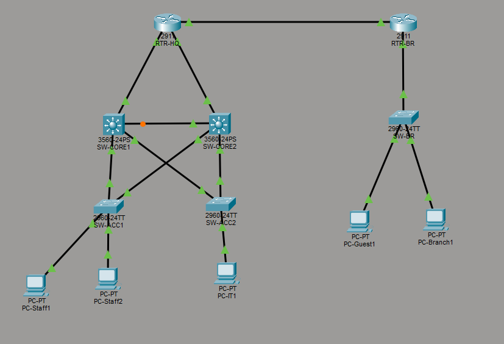

# Two-site enterprise network — Packet Tracer portfolio project

A simulated two-site enterprise network (HQ + Branch) built to demonstrate VLAN segmentation, redundant Layer 3 routing, dynamic routing, and basic network hardening — the core skills behind a network technician / junior network security role. It extends hands-on experience from internships at Tunisie Telecom (switch/router configuration, ADSL/VDSL/fiber access provisioning) and CNRPS Tunis (security-focused ticket handling, log and firewall verification with the SOC team).

## Topology

**HQ site**
- `RTR-HQ` — edge router, WAN link to Branch + uplinks to both core switches
- `SW-CORE1` / `SW-CORE2` — Layer 3 core switches, HSRP pair (Core1 active, Core2 standby)
- `SW-ACC1` — access switch for Staff (VLAN 10) and Guest (VLAN 30)
- `SW-ACC2` — access switch for IT (VLAN 20)

**Branch site**
- `RTR-BR` — branch router, sole gateway for the branch LAN
- `SW-BR` — access switch for Branch Staff (VLAN 40)

## IP addressing plan

| Segment | VLAN | Subnet | Gateway |
|---|---|---|---|
| HQ – Staff | 10 | 192.168.10.0/24 | .1 (HSRP VIP) |
| HQ – IT | 20 | 192.168.20.0/24 | .1 (HSRP VIP) |
| HQ – Guest | 30 | 192.168.30.0/24 | .1 (HSRP VIP) |
| Branch – Staff | 40 | 192.168.40.0/24 | .1 (RTR-BR) |

| Transit link | Subnet |
|---|---|
| RTR-HQ ↔ RTR-BR (WAN) | 10.0.0.0/30 |
| RTR-HQ ↔ SW-CORE1 | 10.0.1.0/30 |
| RTR-HQ ↔ SW-CORE2 | 10.0.2.0/30 |

## Design decisions

- **Routing — OSPF, single area 0.** Runs on RTR-HQ, RTR-BR, SW-CORE1, and SW-CORE2. The core switches also form OSPF adjacencies with each other directly over the VLAN SVIs, so HQ routing survives even if the RTR-HQ uplink to one core fails. RTR-HQ originates a default route, leaving room to add an internet edge later.
- **Redundancy — HSRP.** SW-CORE1 is active (priority 150) for all three HQ VLANs; SW-CORE2 is standby (priority 100) with preempt enabled, so Core1 reclaims the active role automatically after it recovers.
- **Segmentation and hardening.**
  - Guest (VLAN 30) cannot reach Staff or IT subnets at all — enforced by an ACL on the core switches' VLAN 30 interface, applied on both Core1 and Core2 so the policy holds through an HSRP failover.
  - Branch (VLAN 40) can reach HQ IT resources only, not Staff or Guest — enforced by an ACL on RTR-BR's LAN interface.
  - Every access port has port security (max 2 MAC addresses, sticky learning, shuts the port down on violation) plus `portfast` + `bpduguard` since they're host-facing edge ports.
  - Management access is SSH-only with local AAA (`login local`) — no Telnet anywhere.
  - Spanning-tree root is pinned to match the HSRP roles (`SW-CORE1` root primary, `SW-CORE2` root secondary) — without this, STP could pick a root independently of which core is the active gateway, sending traffic on an extra unnecessary hop between the two cores on every packet.

## Test PCs

Add at least one PC per VLAN so you can actually verify the design instead of just trusting the configs. Suggested set:

| PC name | VLAN | Switch port | Static IP | Gateway |
|---|---|---|---|---|
| PC-Staff1 | 10 | SW-ACC1 Fa0/1 | 192.168.10.11/24 | 192.168.10.1 |
| PC-Staff2 | 10 | SW-ACC1 Fa0/2 | 192.168.10.12/24 | 192.168.10.1 |
| PC-IT1 | 20 | SW-ACC2 Fa0/1 | 192.168.20.11/24 | 192.168.20.1 |
| PC-Guest1 | 30 | SW-ACC1 Fa0/13 | 192.168.30.11/24 | 192.168.30.1 |
| PC-Branch1 | 40 | SW-BR Fa0/1 | 192.168.40.11/24 | 192.168.40.1 |

Two PCs on Staff (PC-Staff1/2) let you test something port security alone can't show — plug a third device into one of those ports and watch it get `err-disabled`. A server on the IT VLAN (e.g. `SRV-IT` at 192.168.20.20, running the built-in HTTP service) is also worth adding — it gives Branch something real to reach for the Branch→IT ACL test, and something for Guest to be denied when hitting the IT ACL.

## How to use these configs in Packet Tracer

1. Place the devices as named above and cable them per the topology (see the design diagram from the planning conversation).
2. For each device, open its CLI tab, enter global config mode (`enable` → `configure terminal`), and paste the matching file's contents (everything between `hostname` and `end`).
3. Bring devices up in this order so dependent protocols converge cleanly: access switches → core switches → RTR-HQ → RTR-BR.
4. Verify with `show ip ospf neighbor` (should show full adjacencies), `show standby brief` (Core1 active, Core2 standby), and ping tests across VLANs to confirm the ACLs behave as designed.
5. Save each device's final `show running-config` output back into its file here before you write it up for GitHub.

## Validation

Expected ping results once OSPF has converged and the ACLs are applied — capture this as a screenshot or table for the write-up, it's the evidence that the design does what it claims:

| Source ↓ / Destination → | Staff | IT | Guest | Branch |
|---|---|---|---|---|
| Staff | — | ✅ | ❌ (isolated) | ❌ (see note) |
| IT | ✅ | — | ❌ (isolated) | ✅ |
| Guest | ❌ | ❌ | — | ❌ (isolated) |
| Branch | ❌ | ✅ | ❌ | — |

Guest and Branch show ❌ in both directions even though the ACLs were only written to block traffic *from* Guest/Branch — because these are stateless ACLs, the reply to an HQ-initiated ping is itself sourced from Guest/Branch, so it gets caught by the same deny rule on the way back. For Guest, that's the correct outcome (full isolation is what you want on a guest network). For Branch, it's currently a side effect rather than a deliberate choice — decide whether Staff should be able to reach into Branch (and adjust the ACL with explicit `permit icmp ... echo-reply` entries if so) or whether full isolation is fine as-is.

If any of these don't match what you see in Packet Tracer, check `show ip ospf neighbor` and `show ip route` before assuming the ACL is wrong — most connectivity failures at this stage turn out to be routing, not filtering.

## Files

| File | Device |
|---|---|
| `01-RTR-HQ.txt` | HQ edge router |
| `02-RTR-BR.txt` | Branch router |
| `03-SW-CORE1.txt` | HQ core switch 1 (HSRP active) |
| `04-SW-CORE2.txt` | HQ core switch 2 (HSRP standby) |
| `05-SW-ACC1.txt` | HQ access switch (Staff + Guest) |
| `06-SW-ACC2.txt` | HQ access switch (IT) |
| `07-SW-BR.txt` | Branch access switch |

## Optional next steps

Not required for the core design, but worth adding if you want to push the project further:

- **Native VLAN hardening** — move the native VLAN on every trunk off VLAN 1 onto an unused VLAN (e.g. 999) to close off a common VLAN-hopping vector.
- **DHCP** — configure `SW-CORE1`/`SW-CORE2` (or a dedicated server) as DHCP servers for the HQ VLANs instead of static PC addressing.
- **Console line protection** — add a `password` + `login` under `line con 0` on every device, since right now console access only requires the enable secret once inside privileged mode.
- **Centralized logging** — add `logging <ip>` on every device pointing at a syslog server PC. Given your CNRPS work verifying logs with the SOC team, this is the piece most worth adding: it turns the project from "I can configure a network" into "I can configure a network *and* think about visibility into it."

## Credentials used in these labs

Local username: `admin` / `Cisco123!` — lab-only credentials, change before using this as a template for anything beyond a portfolio simulation.
